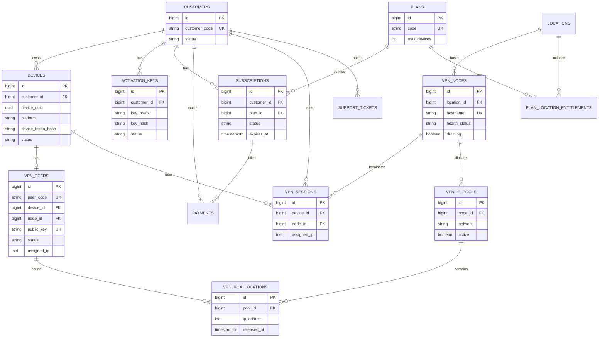

# Database Design & ERD

**Phase:** 3 — Control Plane, IPAM, and VPN Provisioning implemented  
**Engine:** PostgreSQL (production); SQLite supported for tests  
**Last updated:** 2026-08-28

## 1. Principles

- Foreign keys, unique constraints, and indexes enforced in the database
- Transactions + row locking for device-limit, IPAM allocation, and provisioning races
- Soft business statuses via enums / check constraints
- No browsing-history tables
- Secrets (private keys, passwords) never stored in plaintext; WG private keys not stored

## 2. Entity-Relationship Overview

```
customers 1───* devices
customers 1───* activation_keys
devices 1───* device_credentials (at most one active at a time)
devices 1───1 vpn_peers (active MVP)
devices 1───* provisioning_operations
vpn_peers 1───* provisioning_operations
customers 1───* subscriptions *───1 plans
customers 1───* payments
subscriptions 1───* payments
customers 1───* support_tickets
locations 1───* vpn_nodes
vpn_nodes 1───* vpn_ip_pools 1───* vpn_ip_allocations
vpn_peers 1───* vpn_ip_allocations
customers 1───* audit_logs (as subject; actors may be admins)
admin_users *───* roles (RBAC)
```

**Identity separation (never conflate):** Customer ID ≠ Activation Key ≠ Device ID ≠ Device Credential ≠ VPN Peer ID ≠ WireGuard key.

## 3. Core Tables

### customers

No mobile password/email login. Optional contact fields for CRM/support only.

| Column | Type | Notes |
|--------|------|-------|
| id | BIGSERIAL PK | |
| customer_code | VARCHAR UNIQUE | e.g. CUST-000125 |
| name | VARCHAR | |
| phone | VARCHAR NULL | |
| email | CITEXT NULL | Optional CRM contact; not auth |
| status | VARCHAR | ACTIVE, SUSPENDED, BLOCKED, CLOSED |
| notes | TEXT NULL | Admin notes |
| created_at | TIMESTAMPTZ | |
| updated_at | TIMESTAMPTZ | |

### activation_keys

Full plaintext key shown **once** at creation to the admin. Persist only hash/fingerprint + searchable prefix.

| Column | Type | Notes |
|--------|------|-------|
| id | BIGSERIAL PK | |
| customer_id | FK → customers | |
| key_prefix | VARCHAR | e.g. VPN-7KQ2 (searchable; not secret alone) |
| key_hash | VARCHAR | Argon2id / keyed hash of normalized full key |
| status | VARCHAR | ACTIVE, USED, SUSPENDED, REVOKED, EXPIRED |
| activated_at | TIMESTAMPTZ NULL | |
| expires_at | TIMESTAMPTZ NULL | |
| max_activations | INT | |
| activation_count | INT | |
| last_used_at | TIMESTAMPTZ NULL | |
| created_by | FK → admin_users NULL | |
| created_at | TIMESTAMPTZ | |
| revoked_at | TIMESTAMPTZ NULL | |

Key format example: `VPN-7KQ2-F9PX-W3MT` (high entropy; never sequential `VPN-000001`).

### devices

| Column | Type | Notes |
|--------|------|-------|
| id | BIGSERIAL PK | |
| customer_id | FK → customers | |
| device_uuid | UUID | Client-stable UUID |
| platform | VARCHAR | ANDROID, IOS |
| device_name | VARCHAR | |
| os_version | VARCHAR NULL | |
| app_version | VARCHAR NULL | |
| device_token_hash | VARCHAR | Hash of issued device credential |
| status | VARCHAR | ACTIVE, REVOKED, BLOCKED |
| activated_at | TIMESTAMPTZ NULL | |
| last_seen_at | TIMESTAMPTZ NULL | |
| revoked_at | TIMESTAMPTZ NULL | |
| created_at | TIMESTAMPTZ | |

**Unique:** `(customer_id, device_uuid)` (unchanged since Phase 1).

`device_token_hash` is **deprecated as of Phase 2** — `device_credentials` (below) is now the system of record for "does this device have a valid bearer credential". The column is kept (nullable) only for Phase 1 compatibility and is defensively cleared (`null`) whenever `DeviceService` revokes/blocks/resets a device; it is never written to by Phase 2+ code.

### device_credentials (Phase 2)

Opaque, high-entropy bearer tokens issued after activation (ADR-0008). Never stored in plaintext.

| Column | Type | Notes |
|--------|------|-------|
| id | BIGSERIAL PK | |
| device_id | FK → devices, cascade delete | |
| token_prefix | VARCHAR(16) | First 8 chars of the plaintext token — indexed lookup hint, not secret alone |
| token_hash | VARCHAR | Hash (`Hash::make`) of the full opaque token |
| issued_at | TIMESTAMPTZ | |
| expires_at | TIMESTAMPTZ NULL | Optional TTL (`config('activation.device_credential_ttl_days')`); null = no time-based expiry |
| last_used_at | TIMESTAMPTZ NULL | Updated on each authenticated request |
| revoked_at | TIMESTAMPTZ NULL | Set on rotation, self-deactivate, or admin revoke/block/reset-binding |
| created_at / updated_at | TIMESTAMPTZ | |

**Indexes:** `device_id`, `token_prefix`.

**Partial unique index** `device_credentials_one_active_per_device` on `(device_id) WHERE revoked_at IS NULL` — at most one active (non-revoked) credential per device at any time (immediate rotation semantics). Supported identically by SQLite and PostgreSQL; not required to work on MySQL (not a target engine for this project).

**Never count BLOCKED/REVOKED devices toward a plan's device limit** — only `devices.status = ACTIVE` consumes a slot (`DeviceService::activeDeviceCount`).

### plans

| Column | Type | Notes |
|--------|------|-------|
| id | BIGSERIAL PK | |
| name | VARCHAR | Free, Basic, Premium |
| code | VARCHAR UNIQUE | FREE, BASIC, PREMIUM |
| price | NUMERIC(12,2) | |
| currency | CHAR(3) | |
| duration_days | INT | |
| max_devices | INT | |
| traffic_limit_bytes | BIGINT NULL | |
| speed_limit_mbps | INT NULL | |
| active | BOOLEAN | |
| created_at / updated_at | TIMESTAMPTZ | |

Plan–location entitlements via `plan_location_entitlements` (plan_id, location_id) in Phase 1.

### subscriptions

| Column | Type | Notes |
|--------|------|-------|
| id | BIGSERIAL PK | |
| customer_id | FK | |
| plan_id | FK | |
| status | VARCHAR | PENDING, ACTIVE, EXPIRED, CANCELLED, SUSPENDED |
| starts_at | TIMESTAMPTZ | |
| expires_at | TIMESTAMPTZ | |
| auto_renew | BOOLEAN | |
| source | VARCHAR | e.g. WEB, IOS_IAP, ANDROID_IAP, ADMIN |
| created_at | TIMESTAMPTZ | |
| updated_at | TIMESTAMPTZ | |

### payments

Manual / reseller-friendly now; gateway-ready later.

| Column | Type | Notes |
|--------|------|-------|
| id | BIGSERIAL PK | |
| customer_id | FK | |
| subscription_id | FK NULL | |
| payment_method | VARCHAR | CASH, BANK_TRANSFER, KBZPAY, WAVEPAY, MANUAL, … |
| external_reference | VARCHAR NULL | Unique per method/provider when set |
| amount | NUMERIC(12,2) | |
| currency | CHAR(3) | |
| status | VARCHAR | PENDING, PAID, FAILED, REFUNDED, CANCELLED |
| paid_at | TIMESTAMPTZ NULL | |
| notes | TEXT NULL | |
| metadata | JSONB | Non-secret provider fields |
| created_at | TIMESTAMPTZ | |

**Unique (when set):** `(payment_method, external_reference)`

### locations

| Column | Type | Notes |
|--------|------|-------|
| id | BIGSERIAL PK | |
| country_code | CHAR(2) | |
| country_name | VARCHAR | |
| city | VARCHAR | |
| display_name | VARCHAR | |
| latitude | DECIMAL NULL | |
| longitude | DECIMAL NULL | |
| active | BOOLEAN | |
| sort_order | INT | |

### vpn_nodes

| Column | Type | Notes |
|--------|------|-------|
| id | BIGSERIAL PK | |
| location_id | FK | |
| hostname | VARCHAR UNIQUE | |
| code | VARCHAR UNIQUE | e.g. SG-01 |
| management_ip | INET | **Never expose to mobile** |
| public_endpoint | VARCHAR | host:port or host |
| vpn_port | INT | |
| public_key | VARCHAR | Server WG public key |
| capacity_users | INT | |
| current_sessions | INT | Cached/synced |
| health_status | VARCHAR | HEALTHY, DEGRADED, DOWN (liveness/performance) |
| maintenance_mode | BOOLEAN | When true → selection state **MAINTENANCE** |
| draining | BOOLEAN | When true → selection state **DRAINING** (no new assignments; existing sessions remain) |
| lifecycle_status | VARCHAR | ACTIVE, RETIRED — **RETIRED** = permanently removed from service |
| adapter_type | VARCHAR | fake \| remote (Phase 4 dual adapter) |
| agent_endpoint | VARCHAR NULL | e.g. https://127.0.0.1:9443 |
| agent_version | VARCHAR NULL | |
| wireguard_interface | VARCHAR | wg0 |
| weight | INT | Selection weight |
| last_heartbeat_at | TIMESTAMPTZ NULL | |
| last_synced_at | TIMESTAMPTZ NULL | Telemetry sync timestamp |
| latest_rx_bytes | BIGINT | Aggregated traffic received |
| latest_tx_bytes | BIGINT | Aggregated traffic transmitted |
| retired_at | TIMESTAMPTZ NULL | Set when lifecycle_status = RETIRED |
| created_at / updated_at | TIMESTAMPTZ | |

**Selection-facing operational states** (composite — never assign customers to unsafe nodes):

| State | How represented | New assignments | Existing sessions |
|-------|-----------------|-----------------|-------------------|
| HEALTHY | health_status=HEALTHY, not draining, not maintenance, ACTIVE | Allowed | OK |
| DEGRADED | health_status=DEGRADED, else eligible | Policy-weighted | OK |
| DOWN | health_status=DOWN | Rejected | Ops-defined |
| DRAINING | draining=true | Rejected | Remain until natural end |
| MAINTENANCE | maintenance_mode=true | Rejected | Ops-defined |
| RETIRED | lifecycle_status=RETIRED | Rejected | None (decommissioned) |

**Drain** ≠ **Maintenance** ≠ **Retired**: drain is soft capacity exit; maintenance is planned unavailability; retired is permanent inventory removal.

### vpn_peers

Operational peer record (CRM mirror and/or control-plane SoR — see ADR-0003). Prefer not deleting rows; transition lifecycle instead.

| Column | Type | Notes |
|--------|------|-------|
| id | BIGSERIAL PK | |
| peer_code | VARCHAR UNIQUE | e.g. WG-PEER-… |
| device_id | FK → devices | 1:1 active peer per device (MVP) |
| node_id | FK → vpn_nodes | |
| public_key | VARCHAR UNIQUE | Client WG public key |
| assigned_ip | INET | From pool allocation |
| status | VARCHAR | PENDING, ACTIVE, ERROR, REVOKING, REVOKED |
| last_error | TEXT NULL | Sanitized |
| provisioned_at | TIMESTAMPTZ NULL | |
| revoked_at | TIMESTAMPTZ NULL | |
| latest_handshake_at | TIMESTAMPTZ NULL | Real WireGuard latest handshake |
| rx_bytes | BIGINT | Received bytes counter |
| tx_bytes | BIGINT | Transmitted bytes counter |
| last_synced_at | TIMESTAMPTZ NULL | Telemetry sync timestamp |
| created_at / updated_at | TIMESTAMPTZ | |

**Lifecycle:** PENDING → ACTIVE → REVOKING → REVOKED (or ERROR). Do not immediately delete; remove the WireGuard peer from the node while retaining history.

### vpn_ip_pools

Centrally managed overlay pools (control plane). Do not allocate tunnel IPs ad hoc on nodes.

| Column | Type | Notes |
|--------|------|-------|
| id | BIGSERIAL PK | |
| node_id | FK → vpn_nodes | |
| network | INET / CIDR | e.g. 10.200.20.0/24 |
| prefix_length | INT | |
| gateway | INET | |
| active | BOOLEAN | |

Example overlay: `10.200.0.0/16` with per-node `/24` (BKK `.10.0/24`, SIN `.20.0/24`, TYO `.30.0/24`).

### vpn_ip_allocations

| Column | Type | Notes |
|--------|------|-------|
| id | BIGSERIAL PK | |
| pool_id | FK → vpn_ip_pools | |
| device_id | FK → devices | |
| vpn_peer_id | FK → vpn_peers | |
| ip_address | INET | |
| allocated_at | TIMESTAMPTZ | |
| released_at | TIMESTAMPTZ NULL | |

**Unique (active):** one row per `ip_address` where `released_at IS NULL` (partial unique index).

**Allocation rules (Phase 2+ implementation):**

- Allocate inside a **database transaction** with row/advisory locking to prevent races.
- Enforce **uniqueness** of active IPs in the database (not only in application memory).
- Provisioning must be **idempotent**: same Idempotency-Key / same peer intent must not create a second allocation.
- Do not randomly generate IPs independently on nodes; pools are centrally managed.

### vpn_sessions

| Column | Type | Notes |
|--------|------|-------|
| id | BIGSERIAL PK | |
| customer_id | FK | |
| device_id | FK | |
| node_id | FK | |
| assigned_ip | INET | |
| started_at | TIMESTAMPTZ | |
| ended_at | TIMESTAMPTZ NULL | |
| bytes_rx | BIGINT DEFAULT 0 | |
| bytes_tx | BIGINT DEFAULT 0 | |
| termination_reason | VARCHAR NULL | |

No URL / DNS query / payload columns.

### support_tickets

| Column | Type | Notes |
|--------|------|-------|
| id | BIGSERIAL PK | |
| customer_id | FK | |
| subject | VARCHAR | |
| body | TEXT | |
| status | VARCHAR | OPEN, PENDING, RESOLVED, CLOSED |
| created_at / updated_at | TIMESTAMPTZ | |

### audit_logs

| Column | Type | Notes |
|--------|------|-------|
| id | BIGSERIAL PK | |
| actor_type | VARCHAR | ADMIN, SYSTEM, CUSTOMER |
| actor_id | BIGINT NULL | |
| action | VARCHAR | |
| target_type | VARCHAR | |
| target_id | VARCHAR | |
| old_values | JSONB NULL | Sanitized |
| new_values | JSONB NULL | Sanitized |
| source_ip | INET NULL | |
| correlation_id | UUID NULL | |
| created_at | TIMESTAMPTZ | Immutable (no updates) |

### admin_users, roles, permissions

Standard RBAC:

- `admin_users` (email, password_hash, status)
- `roles` (SUPER_ADMIN, NOC, SUPPORT, FINANCE, CONTENT_ADMIN)
- `permissions` + `role_permission` + `admin_user_role`

### idempotency_keys

| Column | Type | Notes |
|--------|------|-------|
| id | BIGSERIAL PK | |
| key | UUID | |
| scope | VARCHAR | e.g. vpn.provision |
| request_hash | VARCHAR | |
| response_body | JSONB NULL | |
| status_code | INT NULL | |
| created_at | TIMESTAMPTZ | |
| expires_at | TIMESTAMPTZ | |

**Unique:** `(scope, key)`

## 4. Mermaid ERD



## 5. Integrity Rules (examples)

1. Active device count ≤ plan.max_devices (transactional lock on customer/subscription).
2. Unique WireGuard public keys globally (`vpn_peers.public_key`).
3. Payment external references unique per payment_method when present (replay safety).
4. Node hostname unique.
5. `customer_code` unique; activation full keys never stored plaintext.
6. Active tunnel IP allocations unique per address (partial unique where `released_at IS NULL`).
7. Peer provisioning allocates IP and creates peer state in one transaction.
8. Device credential hashes are per-device; activation keys are not API bearer tokens.
9. At most one active (non-revoked) `device_credentials` row per device (partial unique index); rotation revokes-then-issues inside a transaction.
10. Activation (`ActivationService`) locks the `customers` row (`lockForUpdate`) for the duration of the activation transaction, serializing concurrent activation attempts for the same customer — this is what makes device-limit enforcement race-safe.

## 6. Control Plane State

Control plane may keep its own operational store (SQLite/PostgreSQL) for:

- Peer desired state and lifecycle
- IP allocation pools per node (`vpn_ip_pools` / `vpn_ip_allocations`)
- Heartbeat cache

Laravel remains system of record for customers, billing, and CRM. Sync strategy: ADR-0003. Design narrative: [HLD.md](./HLD.md) §§ 6–8.

## 7. Migration Policy

- All schema changes via versioned Laravel (and CP) migrations
- No manual production DDL outside change control
- Phase 1: Laravel migrations for CRM core (`customers`, `plans`, `subscriptions`, `activation_keys`, `devices`, `locations`, `vpn_nodes`, `payments`, `audit_logs`, RBAC).
- Phase 2 (forward-only, applied after Phase 1): `device_credentials`. No changes to Phase 1 tables' columns; `devices.device_token_hash` is deprecated in place (see above), not dropped. WireGuard peers/pools/sessions remain Phase 3+.
